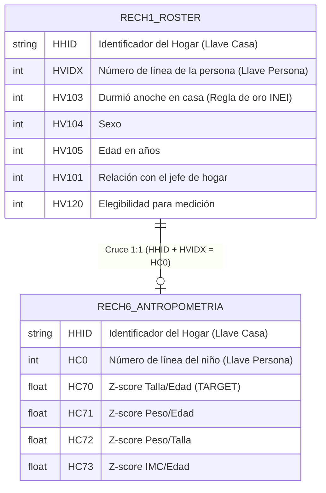

# Arquitectura de Datos ENDES (Modelo de Relaciones)

Este documento mantiene el registro visual y técnico de cómo se cruzan los módulos de la ENDES a medida que avanzamos en el Análisis Exploratorio de Datos (EDA).

## 1. Relación Base: Antropometría y Roster del Hogar

El punto de partida del modelo predictivo es el estado nutricional del niño (`RECH6`), el cual debe cruzarse obligatoriamente con el censo del hogar (`RECH1`) para confirmar su identidad demográfica y cumplir con los requisitos metodológicos del INEI (verificar que el niño durmió en la vivienda).

### Diagrama de Relación (ERD)

> [!IMPORTANT]  
> **Lógica del Cruce (Left Join desde RECH6):**
> Dado que `RECH1` contiene a todos los habitantes (adultos, abuelos, etc.), la relación general es que una persona del Roster tiene *cero o un* registro de antropometría. 
> Al cruzar partiendo desde `RECH6`, el resultado será un cruce perfecto **1 a 1** que descartará automáticamente a los millones de adultos que no son niños medidos.

*(Este documento se actualizará añadiendo `RECH0` / Housing y `MEF` / Madres conforme se analicen).*
