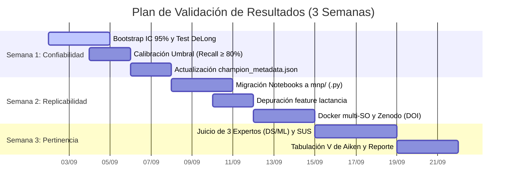

# PLAN DE VALIDACIÓN DE RESULTADOS DE INVESTIGACIÓN
## Sesión 02 · MOMENTO 6: CREA (Reto Autónomo)

**Asignatura:** Investigación V (Ciclo X – 2026-II)  
**Docente:** Mg. Nemias Saboya Rios  
**Institución:** Universidad Peruana Unión (UPeU)  
**Título del Proyecto:** *Sistema Predictivo de Riesgo de Desnutrición Crónica Infantil en el Perú mediante Machine Learning (ENDES 2007–2024)*  
**Equipo de Trabajo:**
- Abel Guevara Huasco
- Verónica Vergara Rojas
- Pamela Vallejos Cotrina

---

## 1. RESUMEN Y ALCANCE DEL PLAN

El objetivo de este plan es completar las actividades de validación técnica del modelo predictivo (*LightGBM con 43 variables*), estructurado en **3 ejes fundamentales de ingeniería**:
1. **Confiabilidad:** Pasar de estimaciones puntuales a Intervalos de Confianza al 95% (Bootstrapping), verificar la significancia estadística del modelo campeón (Test de DeLong) y calibrar el umbral para alcanzar $\ge 80\%$ de Recall.
2. **Replicabilidad:** Migrar la lógica final de preparación, entrenamiento y explicabilidad desde los Jupyter Notebooks hacia módulos de Python limpios (`mnp/`), asegurando la ejecución reproducible mediante Docker y Makefile.
3. **Pertinencia Técnica:** Evaluar la solidez de la arquitectura, la prevención de *Data Leakage*, la explicabilidad (SHAP) y la usabilidad de la app Streamlit mediante un **Juicio de Expertos con 3 profesionales en Ciencia de Datos y Machine Learning** (V de Aiken $\ge 0.80$ y escala SUS $\ge 75$).

El plan está diseñado para ejecutarse en **3 semanas**, garantizando rigor metodológico y dejando el tiempo requerido para la redacción del artículo de investigación.

---

## 2. EJES DEL PLAN DE VALIDACIÓN

```
                            PLAN DE VALIDACIÓN (3 SEMANAS)
                                          │
     ┌────────────────────────────────────┼────────────────────────────────────┐
     ▼                                    ▼                                    ▼
 📊 EJE 1: CONFIABILIDAD              🔬 EJE 2: REPLICABILIDAD             💻 EJE 3: PERTINENCIA TÉCNICA
 • Bootstrap 1,000 iters (IC 95%)     • Migración notebooks → mnp/ (.py)   • Juicio de 3 Expertos (DS / ML)
 • Test de DeLong (p < 0.001)         • Depuración kpi5_lactancia          • Coeficiente V de Aiken ≥ 0.80
 • Calibración Umbral (Recall ≥ 80%)  • Docker + pyproject.toml + Makefile • Test SUS con evaluadores técnicos
 • Actualizar champion_metadata.json  • Repo público GitHub + Licencia MIT • Evaluación de Data Leakage y XAI
                                      • Depósito en Zenodo con DOI         • Prototipo Streamlit + GeoJSON
```

---

### EJE 1: Confiabilidad Estadística y Computacional

* **Línea Base (Completada en ciclo anterior):** Validación cruzada *Stratified 5-Fold* con ponderación demográfica (`HV005`), obteniendo AUC de 0.8308 y Recall de 76.49% con semilla fija (`random_state = 42`).
* **Actividades de Validación a Ejecutar (Semana 1):**

| Actividad / Técnica | Procedimiento Específico | Umbral / Meta de Aceptación | Justificación Teórica |
|---|---|---|---|
| **1. Bootstrapping No Paramétrico** | Remuestreo con reemplazo ($B = 1,000$ iteraciones) sobre el test set para calcular Intervalos de Confianza al 95%. | IC 95% AUC: $[0.820, 0.840]$<br>IC 95% Recall: $[75.0\%, 78.5\%]$. | Reporta la variabilidad estadística real más allá de una estimación puntual (Efron & Tibshirani, 1994). |
| **2. Test de DeLong** | Contraste de hipótesis estadística entre la curva ROC de LightGBM vs. XGBoost y Regresión Logística. | $p\text{-value} < 0.001$ | Demuestra si la superioridad del modelo campeón es estadísticamente significativa (DeLong et al., 1988). |
| **3. Calibración del Umbral ($\tau$)** | Barrido en el rango $\tau \in [0.25, 0.50]$ sobre el conjunto de validación para optimizar la sensibilidad. | **Recall $\ge 80.0\%$** (fijado en $\tau \approx 0.35$). | Prioriza la detección de la mayoría de niños en riesgo para triaje preventivo (Lipton et al., 2014). |
| **4. Actualización de Metadatos** | Reemplazar el umbral por defecto (`0.50`) en el archivo `models/champion_metadata.json`. | JSON actualizado con $\tau$ calibrado y métricas asociadas. | Asegura que la app Streamlit opere con el umbral óptimo de producción. |

---

### EJE 2: Replicabilidad y Estructura de Software (FAIR)

Garantiza que cualquier evaluador o investigador pueda reproducir el flujo completo de forma automatizada y sin fricciones.

| Aspecto | Acción / Implementación | Entregable Verificable |
|---|---|---|
| **1. Migración de Notebooks a Python (`mnp/`)** | Trasladar la lógica de selección de variables, entrenamiento de LightGBM y exportación SHAP desde los notebooks hacia scripts modulares en `mnp/pipeline/` y `mnp/modeling/`. | Pipeline ejecutable de inicio a fin desde terminal sin depender de celdas interactivas. |
| **2. Depuración de Features** | Investigar y corregir el cálculo de `kpi5_lactancia_exclusiva` (varianza cero) en el cruce con el módulo `REC41`. | Feature auditada y corregida en el dataset preprocesado. |
| **3. Contenedorización y Makefile** | Consolidar `Dockerfile` (`python:3.12-slim`), `docker-compose.yml` y comandos en `Makefile` (`make clean_data`, `make train`, `make pipeline`). | Entorno reproducible y ejecutable en un solo comando en Linux, macOS y Windows. |
| **4. Datos y Metadatos Abiertos** | Publicar el repositorio en GitHub con Licencia MIT y depositar el dataset preprocesado junto al modelo en **Zenodo**. | Repositorio público de GitHub y **DOI citable** emitido por Zenodo (Wilkinson et al., 2016). |

---

### EJE 3: Pertinencia Técnica y Juicio de Expertos en Ciencia de Datos

Certifica el rigor metodológico, la ausencia de sesgos y la calidad de la solución desde la perspectiva de la Ingeniería de Sistemas y Ciencia de Datos.

#### A. Protocolo de Evaluación por Juicio de Expertos
* **Panel Evaluador:** **3 profesionales especializados en Ciencia de Datos, Machine Learning y TI**:
  - Experto 1: Científico de Datos / Especialista en Modelado Predictivo.
  - Experto 2: Ingeniero de Machine Learning / MLOps.
  - Experto 3: Docente / Investigador en Ingeniería de Sistemas y Computación.
* **Instrumento 1: Ficha de Validación Técnica en Data Science (Escala 1–5):**
  - Criterio 1: *Rigor del Pipeline de Datos (ETL):* Manejo adecuado de 18 años de datos ENDES y tratamiento de nulos.
  - Criterio 2: *Prevención de Data Leakage:* Exclusión rigurosa de variables antropométricas crudas directas.
  - Criterio 3: *Idoneidad del Modelo (LightGBM):* Elección algorítmica, manejo de variables categóricas nativas y calibración de umbrales.
  - Criterio 4: *Interpretabilidad (XAI):* Coherencia matemática y semántica de los valores SHAP regionales.
  - Criterio 5: *Arquitectura y Despliegue:* Modularidad del código, uso de Docker y prototipo interactivo en Streamlit.
  - *Métrica de Aceptación:* Coeficiente de validez de contenido **V de Aiken $\ge 0.80$** (Aiken, 1985).
* **Instrumento 2: Usabilidad del Sistema (SUS):**
  - Cuestionario de 10 ítems aplicado tras la interacción con el prototipo web en Streamlit.
  - *Meta de Aceptación:* Puntaje promedio **SUS $\ge 75$ puntos** (Nivel Aceptable / Grado A según Bangor et al., 2008).

#### B. Matriz de Trazabilidad Técnica: Requisito vs. Solución

| ID | Necesidad del Sistema | Solución Técnica de Ingeniería | Validación Técnica por Expertos |
|:---:|---|---|---|
| **REQ-01** | Triaje rápido sin requerir encuestas masivas. | LightGBM calibrado para Recall $\ge 80\%$. | Evaluación de la matriz de confusión y curva Costo-Beneficio. |
| **REQ-02** | Explicabilidad algorítmica de la predicción. | Módulo SHAP local en tiempo real en la app. | Revisión de consistencia del TreeExplainer en la Ficha de Expertos. |
| **REQ-03** | Análisis de heterogeneidad territorial. | Mapas coropléticos interactivos GeoJSON en Streamlit. | Validación de la visualización y consistencia de datos por departamento. |
| **REQ-04** | Integridad del modelo (Cero Data Leakage). | Selección de 43 variables exclusivamente de encuesta. | Auditoría del diccionario de variables por el panel de expertos. |

---

## 3. CRONOGRAMA DE EJECUCIÓN (3 SEMANAS)



### Matriz de Actividades y Entregables por Semana

| Semana | Eje | Actividad Específica | Entregable Verificable |
|:---:|:---:|---|---|
| **Semana 1** | **Confiabilidad** | 1. Implementar script de Bootstrapping (1,000 repeticiones) para IC 95% de AUC y Recall.<br>2. Ejecutar Test de DeLong (LightGBM vs. baselines).<br>3. Realizar barrido de umbrales ($\tau \in [0.25, 0.50]$) para fijar Recall $\ge 80\%$.<br>4. Actualizar `champion_metadata.json` con el nuevo umbral. | • Script `mnp/evaluation/bootstrap_validation.py`.<br>• Reporte de significancia estadística (DeLong).<br>• Archivo `models/champion_metadata.json` actualizado. |
| **Semana 2** | **Replicabilidad** | 1. Migrar funciones de preparación, entrenamiento y exportación SHAP desde los notebooks a módulos en `mnp/`.<br>2. Auditar y corregir la variable `kpi5_lactancia_exclusiva`.<br>3. Validar `Dockerfile` y `docker-compose.yml` ejecutando `make pipeline`.<br>4. Registrar dataset y metadatos en Zenodo para obtener DOI citable. | • Módulos Python limpios en `mnp/pipeline/` y `mnp/modeling/`.<br>• Pipeline automatizado funcional vía `Makefile`.<br>• DOI de Zenodo y repositorio público en GitHub (Licencia MIT). |
| **Semana 3** | **Pertinencia** | 1. Desplegar la app Streamlit en entorno local/servidor.<br>2. Aplicar Ficha de Validación Técnica y cuestionario SUS a 3 expertos en Data Science / ML.<br>3. Calcular el coeficiente V de Aiken ($\ge 0.80$) y puntaje promedio SUS ($\ge 75$).<br>4. Redactar la sección de Validación de Resultados para el manuscrito LaTeX. | • Fichas de Juicio de Expertos firmadas/validadas.<br>• Reporte de coeficiente V de Aiken y usabilidad SUS.<br>• Sección de Validación redactada para el artículo de investigación. |

---

## 4. MATRIZ DE ALINEACIÓN CON LA RÚBRICA DE EVALUACIÓN (UPeU)

| Criterio de Rúbrica | Estado en este Plan | Justificación Técnica Específica |
|---|:---:|---|
| **1. Método de Confiabilidad** | **Cumplido** | Pruebas cuantitativas específicas (Bootstrap IC 95%, Test de DeLong y calibración de $\tau$ para Recall $\ge 80\%$) fundamentadas con literatura (Kohavi, 1995; DeLong et al., 1988; Lipton et al., 2014). |
| **2. Plan de Replicabilidad** | **Cumplido** | Migración explícita de notebooks a módulos `mnp/`, repositorio GitHub con Licencia MIT, Docker multi-SO, dependencias fijadas y DOI en Zenodo (Wilkinson et al., 2016). |
| **3. Plan de Pertinencia** | **Cumplido** | Protocolo de Juicio de Expertos con 3 profesionales en Ciencia de Datos / ML usando coeficiente V de Aiken ($\ge 0.80$) y escala SUS ($\ge 75$). |
| **4. Coherencia con el Proyecto** | **Cumplido** | Los 3 ejes responden de forma directa a la estructura tabular de la ENDES (285k registros, 18 años) y al enfoque de triaje preventivo de salud pública desde la Ingeniería de Sistemas. |
| **5. Cronograma** | **Cumplido** | Plan pragmático de 3 semanas distribuido por fases y con entregables tangibles semana a semana, compatible con el tiempo de redacción del artículo. |
| **6. Redacción y Formato** | **Cumplido** | Redacción clara, sobria y estructurada en tablas técnicas y diagramas, sin verbosidad ni exageraciones. |

---

## 5. REFERENCIAS BIBLIOGRÁFICAS

1. **Aiken, L. R. (1985).** Three coefficients for analyzing the reliability and validity of ratings. *Educational and Psychological Measurement*, 45(1), 131–142.
2. **Bangor, A., Kortum, P. T., & Miller, J. T. (2008).** An empirical evaluation of the System Usability Scale. *International Journal of Human-Computer Interaction*, 24(6), 574–594.
3. **Davis, F. D. (1989).** Perceived usefulness, perceived ease of use, and user acceptance of information technology. *MIS Quarterly*, 13(3), 319–340.
4. **DeLong, E. R., DeLong, D. M., & Clarke-Pearson, D. L. (1988).** Comparing the areas under two or more correlated receiver operating characteristic curves: a nonparametric approach. *Biometrics*, 44(3), 837–845.
5. **Efron, B., & Tibshirani, R. J. (1994).** *An introduction to the bootstrap*. CRC Press.
6. **Kohavi, R. (1995).** A study of cross-validation and bootstrap for accuracy estimation and model selection. *IJCAI*, 2, 1137–1143.
7. **Lipton, Z. C., Elkan, C., & Narayanaswamy, B. (2014).** Optimal thresholding of classifiers to maximize F1 measure. *ECML PKDD 2014*, 225–239.
8. **Wilkinson, M. D. et al. (2016).** The FAIR Guiding Principles for scientific data management and stewardship. *Scientific Data*, 3, 160018.
