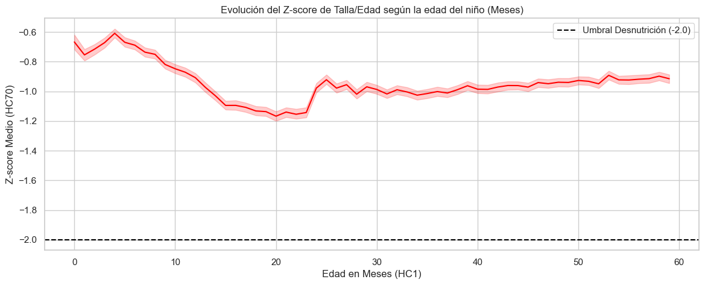
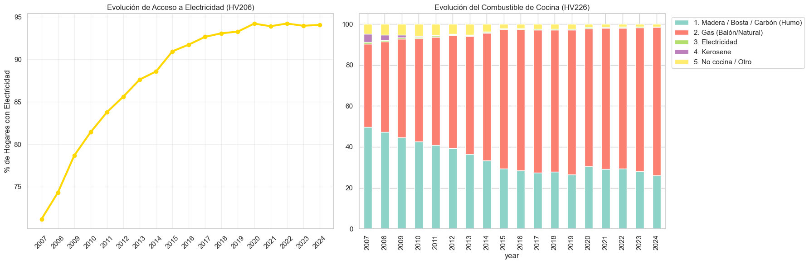
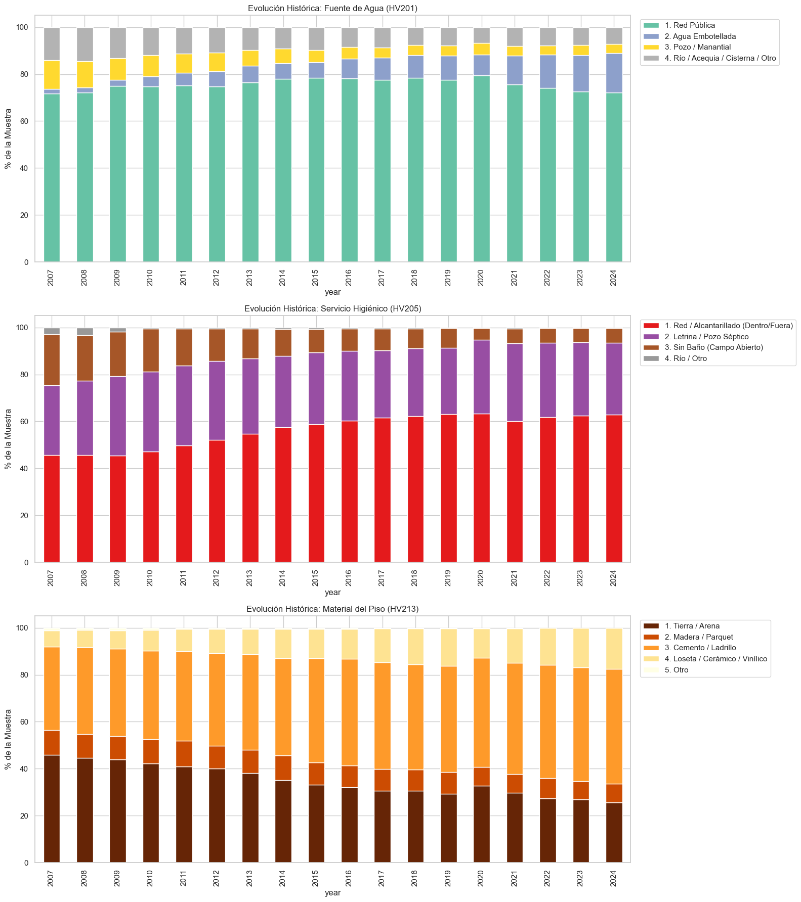

# FASE 2: COMPRENSIÓN DE LOS DATOS

---

### Diapositiva 2.1: El Reto de 18 Años en SPSS

**Contenido Visual:**

**El problema: los archivos SPSS no son estáticos**

- La ENDES distribuye sus datos en archivos `.sav` con etiquetas de columnas y valores que **cambian entre ediciones anuales**.
- Concatenar directamente los 18 años de datos produce inconsistencias silenciosas — el mismo concepto con distintos nombres o códigos.

**Tipos de inconsistencia encontrados:**

| Tipo                  | Descripción                                              | Ejemplo real                                      |
| --------------------- | --------------------------------------------------------- | ------------------------------------------------- |
| Renombre de columna   | La misma variable cambia de nombre entre años            | `HV022` / `hv022` / `Estrato`               |
| Reetiquetado de valor | El mismo código numérico cambia de significado          | `1.0` / `"Sí"` / `"Si"` / `"Yes"`        |
| Variable reciclada    | Una columna desaparece y reaparece con distinto contenido | Preguntas de saneamiento post-2015                |
| Falso numérico SPSS  | Valores de control codificados como números reales       | `9998` → significa "No sabe", no 9998 unidades |

**Guion del Expositor:**

> "Al trabajar con 18 años de la ENDES, el primer obstáculo no fue estadístico sino de ingeniería de datos. Los archivos SPSS del INEI no son consistentes entre ediciones. En algunos años la misma variable se llama HV022, en otros hv022, y en otros Estrato. Los valores categóricos que un año están codificados como el número 1 aparecen otro año como texto 'Sí' o 'Si'. Y hay un problema más sutil: SPSS almacena códigos de control como si fueran números reales — el valor 9998 no significa 9998 unidades de talla, significa que el encuestador marcó 'No sabe'. Si no se detecta y neutraliza, el modelo aprende que algunos niños miden casi 10 metros. Fue necesario auditar registro por registro, año por año, cómo evolucionó cada variable antes de poder procesar un solo dato."

---

### Diapositiva 2.2: Hallazgos del Análisis Exploratorio

**Contenido Visual:**

**RECH6 — El Target en movimiento (294,109 niños):**

> `[INSERTAR: notebooks/01_data_understanding/clean/01_eda_interim_rech6.ipynb` — barras apiladas "Distribución del Target por Año 2007-2024" (Desnutrido/Sano). Muestra el drift de ~30% a ~11%.`]`

| Hallazgo             | Dato                                                                                                                 |
| -------------------- | -------------------------------------------------------------------------------------------------------------------- |
| Prevalencia 2007     | ~30% de desnutrición crónica                                                                                       |
| Prevalencia 2024     | ~11% — el problema se volvió un bolsón residual                                                                   |
| Desbalance de clases | ~16% positivos vs ~84% negativos — el Accuracy queda prohibido                                                      |
| Ventana crítica     | Caída nutricional mes 6-20, escalón de recuperación en mes 24 (artefacto OMS) → justifica algoritmos no lineales |
| Anemia (`HC57`)    | ~30% de niños afectados en 2024 — predictor estable sin drift                                                      |

> `[INSERTAR: notebooks/01_data_understanding/clean/01_eda_interim_rech6.ipynb` — lineplot "HC70 promedio por edad en meses". Muestra el valle entre mes 6-20 y el escalón abrupto en mes 24.`]`
> 

**RECH0, RECH1, RECH23 — El ecosistema socioeconómico:**

> `[INSERTAR: notebooks/01_data_understanding/clean/03_eda_interim_rech23.ipynb` — barras apiladas "Evolución de la Trinidad Biológica por Año" (piso de tierra / campo abierto / leña). Muestra el estancamiento en ~25%.`]`
> 
> 

| Hallazgo              | Dato                                                                                                                      |
| --------------------- | ------------------------------------------------------------------------------------------------------------------------- |
| "Trinidad Biológica" | Piso de tierra (25%) + campo abierto (5%) + leña (25%) en 2024 — los primeros y el tercero estancados                   |
| Altitud               | Distribución bimodal: costa (0-500 m) vs meseta andina (2,500-4,500 m) → ajuste fisiológico de hemoglobina obligatorio |
| Paradoja tecnológica | Celular: 96% → perdió poder predictivo. Refrigeradora: 48% → marcador real de solvencia económica                     |
| Educación            | Tener solo primaria en 2024 es marcador de vulnerabilidad extrema (en 2007 era lo estándar)                              |
| Muestra focalizada    | Quintiles 1 y 2 de riqueza = 60% de la base — foco estructural en hogares vulnerables                                    |

**Guion del Expositor:**

> "El análisis exploratorio arrojó hallazgos que impactaron directamente las decisiones de modelado. En RECH6, el hallazgo más crítico es el Target Drift: en 2007 casi uno de cada tres niños era desnutrido crónico; hoy es uno de cada nueve. El riesgo base cambió radicalmente con el tiempo, lo que hace inválido un split aleatorio clásico — necesitamos validación temporal. El desbalance de 16 contra 84 descarta el Accuracy. Y la curva de acumulación clínica confirma la ventana crítica de los primeros 1000 días: los niños caen entre el mes 6 y el 20 con una recuperación abrupta al mes 24 que es en parte un artefacto del cambio de protocolo de medición de la OMS entre longitud acostado y talla de pie. Esta no linealidad es la razón fundamental por la que necesitamos árboles de decisión. La anemia, en cambio, se mantiene estable como comorbilidad en todos los años. En cuanto al ecosistema socioeconómico, el hallazgo más importante es la Trinidad Biológica: piso de tierra, campo abierto y cocina con leña coexisten en un 25% de hogares en pleno 2024 y llevan 5 años sin bajar. Cuando estas tres condiciones coexisten, el cuerpo del niño desvía todos sus nutrientes a combatir infecciones en lugar de crecer. Sobre la altitud: a 4,000 metros el cuerpo produce más hemoglobina por hipoxia, entonces sin corregir este factor el modelo clasificaría como sanos a niños que en realidad están anémicos. Y sobre el celular: ya llegó al 96% de los hogares — ya no sirve para separar perfiles económicos. La refrigeradora sigue siendo el marcador real."

---

### Diapositiva 2.3: Reglas de Retención y Calidad de Datos

**Contenido Visual:**

**Cuatro operaciones de estandarización aplicadas:**

| Operación           | Criterio                                                                         | Ejemplo                                                        |
| -------------------- | -------------------------------------------------------------------------------- | -------------------------------------------------------------- |
| DROP                 | Variables con más del 70% de nulos en el merge / 60% en selección de variables | `HV018` — ID del entrevistador                              |
| KEEP                 | Variables core con presencia longitudinal estable                                | `HC1` — Edad en meses                                       |
| COALESCE             | Fusión de columnas con mismo concepto, distinto nombre                          | `HV022` / `hv022` / `Estrato` → una sola serie continua |
| Neutralización SPSS | Conversión de falsos numéricos a nulo matemático                              | `9998` → `NaN`, `HC3 / 10.0` → cm reales               |

**Nulos en el Target — decisión de eliminación, no imputación:**

- Los nulos en `HC70` son **MNAR** (Missing Not At Random): causados por rechazo de la madre o ausencia del niño, no por error aleatorio.
- Imputar la variable objetivo es estadísticamente inválido.
- Porcentaje eliminado: menor al 3% en años recientes — pérdida aceptable.

**Variables bloqueadas por Data Leakage:**

- `HC2` Peso crudo, `HC3` Talla cruda — con estas variables el diagnóstico es trivial
- `HC71`, `HC72`, `HC73` — Z-scores derivados del mismo cálculo que el target
- `HC15` — método de medición (acostado / de pie): correlación espuria con la edad del niño

**Guion del Expositor:**

> "Una vez completado el análisis exploratorio, formalizamos las reglas de retención. La guillotina de nulos se aplicó en dos etapas: al consolidar el merge se usó un umbral del 70%, que eliminó 23 columnas; en la selección de variables se revisó al 60%, pero en ese punto las columnas esparsas ya habían sido removidas. El resultado neto fue el mismo: las variables sin señal histórica quedaron fuera. Para el target específicamente, los nulos no son aleatorios — son sistemáticos. Cuando una madre rechaza que midan a su hijo, el dato se pierde de forma estructural. Eso se llama MNAR, y intentar imputarlo con la media o con KNN sería inventar diagnósticos clínicos. Los eliminamos. El COALESCE resolvió el problema de las variables renombradas: en lugar de tener tres columnas distintas para el mismo concepto, las fusionamos en una sola serie continua de 18 años. Finalmente, tres categorías de variables fueron bloqueadas por fuga de datos antes de cualquier modelado: el peso y la talla crudos, porque con ellos el diagnóstico nutricional es matemáticamente directo; los Z-scores derivados, porque son el mismo cálculo que el target; y el método de medición, porque solo correlaciona con la edad del niño y no agrega información causal."
