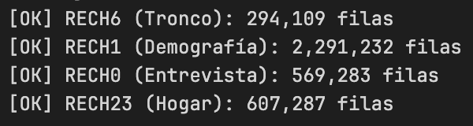
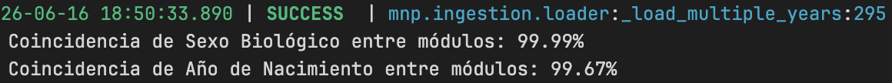
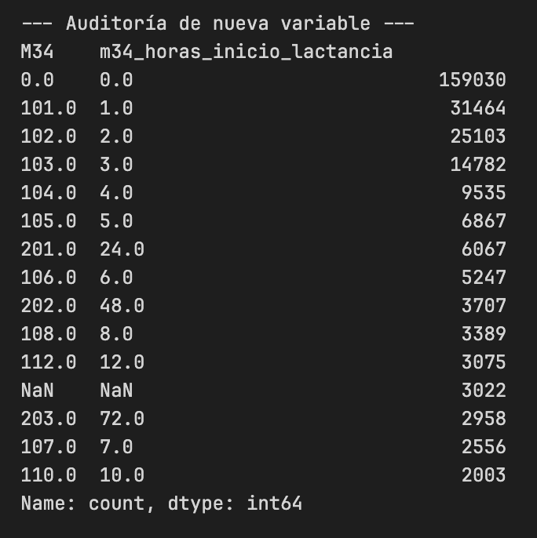
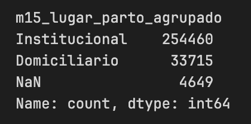
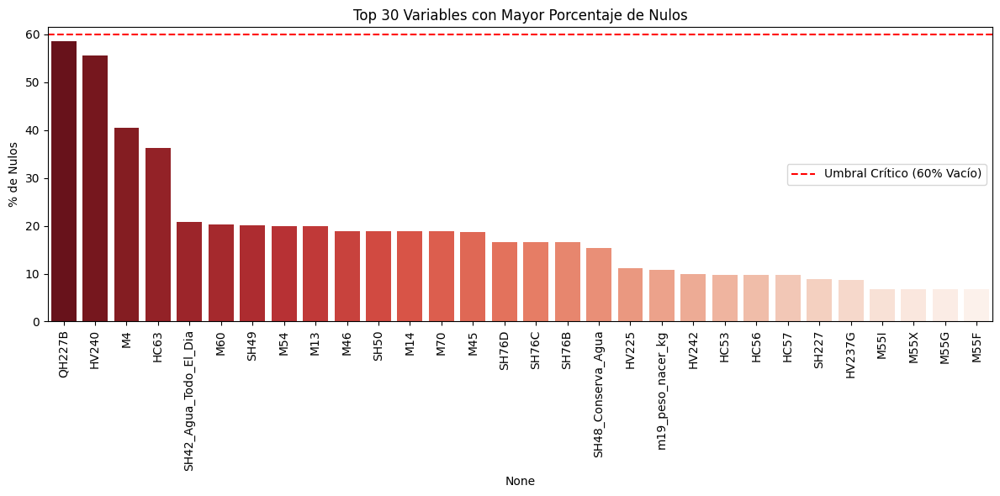
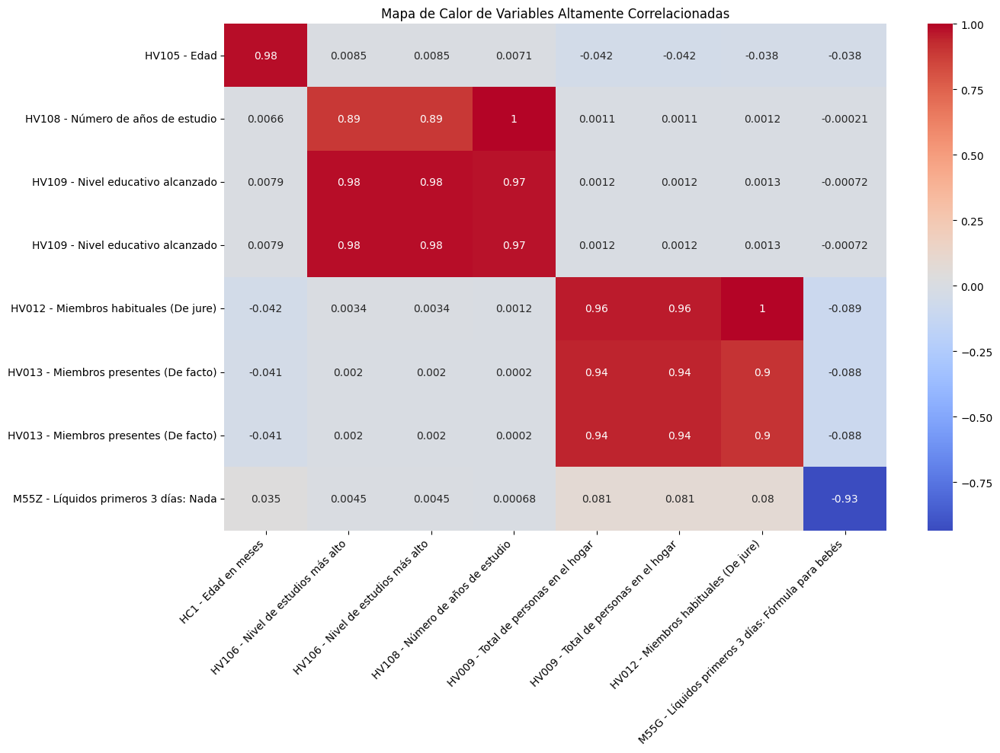
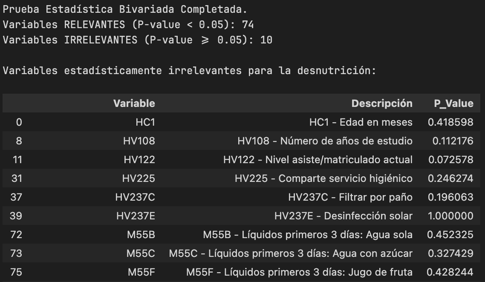

# FASE 3: PREPARACIÓN DE LOS DATOS

---

### Diapositiva 3.1: Criterios de Inclusión y Merge Longitudinal

**Contenido Visual:**

**¿Quién entra al dataset?**

| Criterio           | Regla                                                                      | Fuente |
| ------------------ | -------------------------------------------------------------------------- | ------ |
| Residente habitual | `HV103 = 1` — solo personas que durmieron en el hogar la noche anterior | RECH1  |
| Target válido     | `HC70` no nulo — nulos MNAR excluidos sin imputación                   | RECH6  |

> RECH6 contiene por diseño solo niños menores de 5 años — no fue necesario aplicar un filtro adicional de edad.

**Universo inicial por módulo (antes del merge):**

> `[INSERTAR: notebooks/02_data_preparation/01_merge_master.ipynb` — Celda 2: print de carga inicial. Muestra las 4 líneas de log: RECH6 (294,109 filas), RECH1 (2,291,232 filas), RECH0 (569,283 filas), RECH23 (607,287 filas). Captura como bloque de texto de terminal.]`

**Validación del puente REC21 (auditoría biológica cruzada):**

> `[INSERTAR: notebooks/02_data_preparation/01_merge_master.ipynb` — Celda 15: print de auditoría de identidad. Muestra "Coincidencia de Sexo Biológico entre módulos: 99.99%" y "Coincidencia de Año de Nacimiento entre módulos: 99.67%". Captura como bloque de texto de terminal.]`

**Estructura del merge por llaves primarias:**

| Unión         | Clave compartida                                                               | Resultado                                        |
| -------------- | ------------------------------------------------------------------------------ | ------------------------------------------------ |
| RECH6 + RECH1  | `year + HHID` / `HC0 = HVIDX`                                              | Biometría del niño + perfil individual         |
| RECH1 + RECH0  | `year + HHID`                                                                | Perfil individual + datos del hogar              |
| RECH0 + RECH23 | `year + HHID`                                                                | Hogar + infraestructura y entorno                |
| RECH6 + REC41  | Vía tabla puente`REC21` (B16 = línea del hijo en historial de nacimientos) | Biometría del niño + historia clínica materna |

**Dimensiones del merge por etapa:**

```
RECH6 + RECH1 + RECH0 + RECH23  →  294,109 × 183
+ REC41 vía REC21                →  294,109 × 211
- Umbral 70% nulos (23 columnas) →  294,109 × 189  ← master_merged_v2.parquet
```

**Guion del Expositor:**

> "La construcción del dataset tiene dos restricciones de inclusión. La primera es HV103 igual a 1 — solo residentes habituales del hogar. RECH1 contenía 2,291,232 individuos; aplicar este filtro dejó 2,177,190 residentes válidos. La segunda es que HC70 no sea nulo — los nulos son MNAR y no se imputan. RECH6 ya contiene por diseño solo niños menores de 5 años, así que no se necesitó un filtro adicional de edad. El desafío real del merge fue REC41. Los demás módulos comparten HHID y se unen directamente. REC41, en cambio, está organizado por embarazo de la madre. Para conectar cada parto en REC41 con el hijo correcto en RECH6, usamos el registro REC21 como tabla puente: extraemos el número de línea del hijo (campo B16) y lo cruzamos con HC0 en RECH6. La auditoría biológica validó el resultado: 99.99% de coincidencia de sexo y 99.67% de año de nacimiento. El merge completo produjo 211 columnas, de las cuales 23 fueron eliminadas por tener más del 70% de nulos — dejando 189 columnas en el dataset final."

---

### Diapositiva 3.2: Ingeniería de Variables Clínicas

**Contenido Visual:**

**Hemoglobina y el problema de la altitud:**

- `HC57` — hemoglobina cruda: **no comparable** entre costa y sierra sin corrección
- `HC56` — hemoglobina ajustada por altitud: calculada por el INEI según la directriz OMS, actualizada en 2024 con la RM 251-2024-MINSA
- El proyecto usa `HC56` directamente — la corrección ya viene hecha en los datos del INEI

> A mayor altitud, el cuerpo produce más hemoglobina por hipoxia. Sin corregir, un niño en Puno parece sano cuando en realidad está anémico.

**Target binario:**

```python
TARGET_DESNUTRICION = (HC70 < -2.0).astype(int)
# 285,284 registros con HC70 válido → usados en modelado
```

**Ingeniería aplicada a REC41 (historia clínica materna):**

| Variable original                        | Transformación                  | Variable resultante                  |
| ---------------------------------------- | -------------------------------- | ------------------------------------ |
| `M19` — peso al nacer (gramos)        | Escalar:`/ 1000.0`             | `m19_peso_nacer_kg`                |
| `M34` — horas a primera lactancia     | Decodificación geométrica SPSS | `m34_horas_primera_lactancia`      |
| `M15` — lugar del parto               | Agrupación binaria              | `Institucional` / `Domiciliario` |
| `M46` — días de suplemento de hierro | Imputar 0 si`M45 = 0`          | `m46_dias_hierro`                  |

> `[INSERTAR: notebooks/01_data_understanding/raw/rec41_salud_materna/03_feature_engineering_rec41.ipynb` — Celda 1: tabla value_counts de M34 decodificado. Muestra el código geométrico SPSS (0.0, 101.0, 102.0, 201.0...) traducido a horas reales (0.0, 1.0, 2.0, 24.0...) con frecuencias. Captura como tabla de dos columnas.]`

> `[INSERTAR: notebooks/01_data_understanding/raw/rec41_salud_materna/03_feature_engineering_rec41.ipynb` — Celda 3: value_counts de m15_lugar_parto_agrupado. Muestra "Institucional: 254,460 / Domiciliario: 33,715". Captura como bloque de texto corto.]`

**Guion del Expositor:**

> "La ingeniería de variables tuvo dos frentes. El primero fue la hemoglobina. HC57 es la medición cruda en el campo, pero no es clínicamente comparable entre niños de distintas altitudes. A 4,000 metros el cuerpo produce más hemoglobina de forma natural por la hipoxia — si usamos ese valor crudo, el modelo aprende que los niños de la sierra están más sanos que los de la costa, cuando la realidad es exactamente la opuesta. El INEI publica HC56 como la hemoglobina ya ajustada por altitud según protocolo OMS, incluso actualizada en 2024 con la nueva directriz ministerial. Usamos HC56 directamente. El segundo frente fue el módulo materno REC41. Sus variables no vienen limpias: el peso al nacer está en gramos con valores SPSS especiales, las horas a la primera lactancia tienen una codificación geométrica propia del INEI, y el lugar del parto tiene múltiples categorías que agrupamos en dos — institucional o domiciliario. Esas transformaciones convierten variables de encuesta cruda en predictores utilizables."

---

### Diapositiva 3.3: Selección Matemática de Variables

**Contenido Visual:**

**Pipeline de reducción: 189 columnas → 79 columnas**

```
189 cols (master_merged)
 → drop leakage + drop HC70 NaN  →  285,284 filas × 129 cols
 → colinealidad > 0.85 (−43)     →  285,284 × 86
 → bivariate + XGBoost (−7)      →  285,284 × 79  ← master_preprocessed_v2.parquet
```

> `[INSERTAR: notebooks/02_data_preparation/02_feature_selection_v3.ipynb` — Celda 2: barplot seaborn "Top 30 Variables con Mayor Porcentaje de Nulos". Eje X: variables (rotadas 90°), Eje Y: % de nulos. Línea horizontal roja en 60% ("Umbral Crítico"). Ninguna variable supera el umbral — todas quedan por debajo.]`
> 

> `[INSERTAR: notebooks/02_data_preparation/02_feature_selection_v3.ipynb` — Celda 3: heatmap seaborn coolwarm "Mapa de Calor de Variables Altamente Correlacionadas". Muestra los 10 primeros pares con r > 0.85. Anotaciones numéricas de correlación. Ejemplos visibles: HV109/HV106 = 0.98, HV012/HV009 = 0.96.]`
> 

| Etapa | Método                                      | Resultado                                  | Criterio                                                                                                |
| ----- | -------------------------------------------- | ------------------------------------------ | ------------------------------------------------------------------------------------------------------- |
| 0     | Drop leakage + filas HC70=NaN                | 189 → 129 cols / 294,109 → 285,284 filas | HC2, HC3, HC70, HC71-73, HC15 y otros no predictivos                                                    |
| 1     | Verificación de nulos (60%)                 | 0 eliminadas                               | Columnas esparsas ya removidas en merge con umbral 70%                                                  |
| 2     | Colinealidad — Pearson entre numéricas     | −43 columnas                              | Correlación > 0.85 entre pares numéricos (ej. HV109/HV106 = 0.98)                                     |
| 3     | Pruebas bivariadas (86 features → 2 grupos) | 74 relevantes / 10 no significativas       | **41 numéricas → Kruskal-Wallis** / **37 categóricas → Chi-cuadrado** / umbral p < 0.05 |
| 4     | Validación multivariada XGBoost             | −7 columnas con importancia = 0           | Variables sin aporte en presencia de las demás 78                                                      |

> `[INSERTAR: notebooks/02_data_preparation/02_feature_selection_v3.ipynb` — Celda 5: tabla de 10 variables estadísticamente irrelevantes (Kruskal-Wallis / Chi², p >= 0.05). Columnas: Variable, Descripción, P_Value. Ejemplos: HC1 (edad en meses, p=0.419), HV237E (desinfección solar, p=1.000), kpi5_lactancia_exclusiva (NaN — bug de join conocido).]`
> 

**Resultado:** `master_preprocessed_v2.parquet` — **285,284 filas × 79 columnas**

**Guion del Expositor:**

> "El punto de partida del notebook de selección es 129 columnas, no 189 — porque al cargar el merge lo primero que se hace es eliminar las variables de leakage y las filas donde HC70 es nulo. Eso reduce las filas de 294,109 a 285,284 y las columnas a 129. Desde ahí, el pipeline tiene cuatro pasos. La verificación de nulos al 60% no elimina nada, porque las columnas esparsas ya fueron removidas en el merge con umbral del 70%. El paso que más reduce el espacio es la colinealidad: con Pearson entre variables numéricas, se identifican pares como HV109 y HV106 que tienen correlación de 0.98 — son matemáticamente redundantes. Eso eliminó 43 columnas. La siguiente etapa son las pruebas bivariadas — aquí es importante aclarar el por qué de cada test. No se usa Pearson porque Pearson mide correlación lineal entre dos numéricas, y aquí el target es binario. De las 86 columnas que llegan a esta etapa, 41 son numéricas y 37 son categóricas. Para las numéricas se usa Kruskal-Wallis, que compara si la distribución de la variable difiere entre los grupos desnutrido y sano sin asumir que los datos son normales — lo cual sería inválido para datos de encuesta de salud. Para las categóricas se usa Chi-cuadrado, que prueba independencia en una tabla de contingencia. 74 variables pasan con p menor a 0.05. Las 10 que no, son marcadas. El paso final es un XGBoost entrenado en el espacio multivariado completo, que confirma que exactamente 7 variables tienen importancia cero — es decir, cuando las otras 78 están presentes, estas 7 no agregan ningún poder predictivo. Se eliminan. El resultado son 79 variables en total y 285,284 niños."
