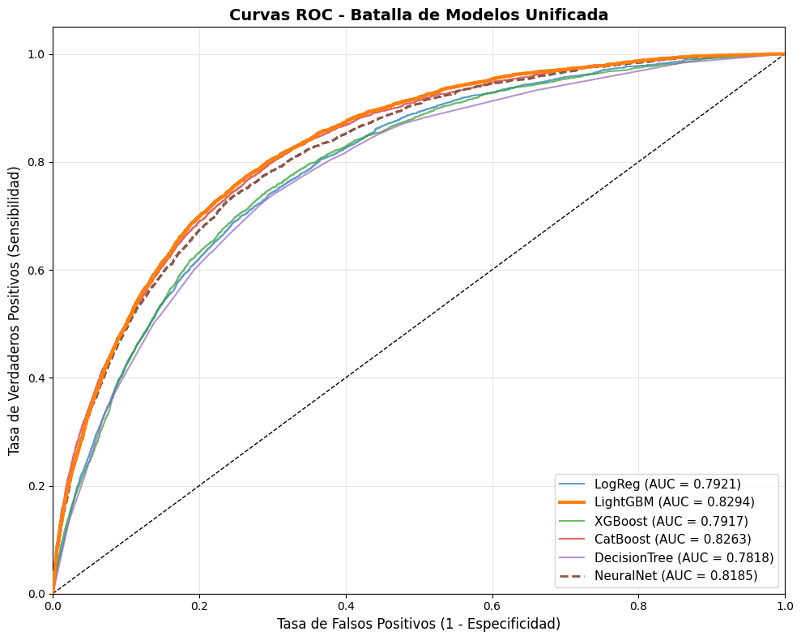
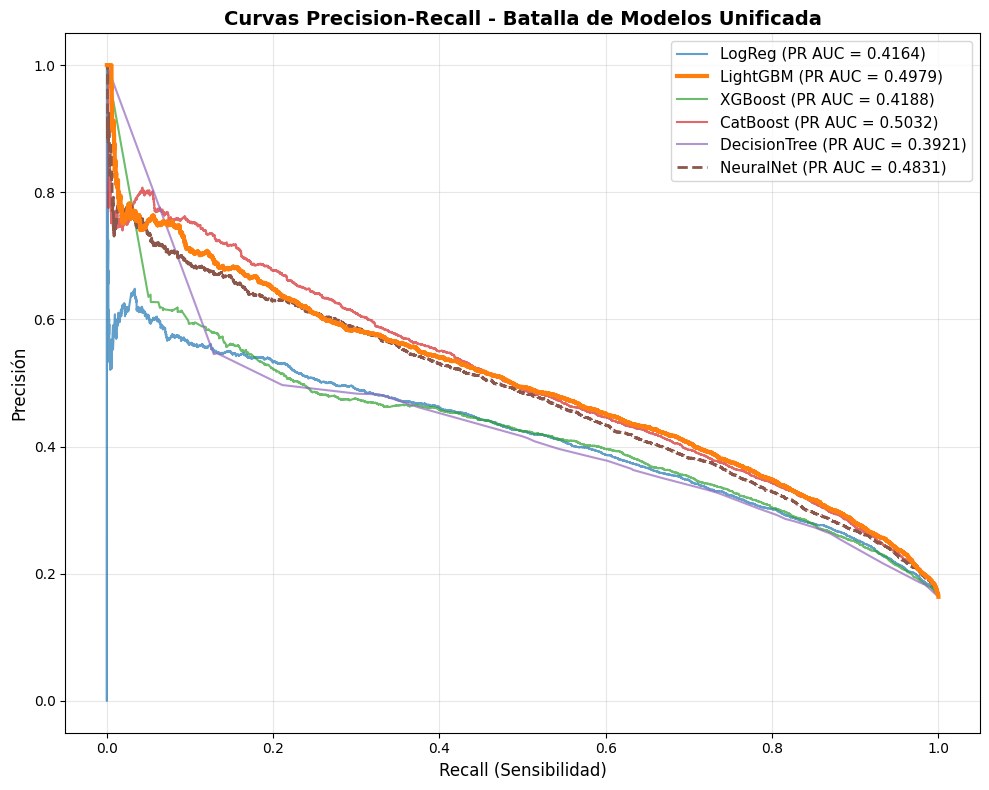
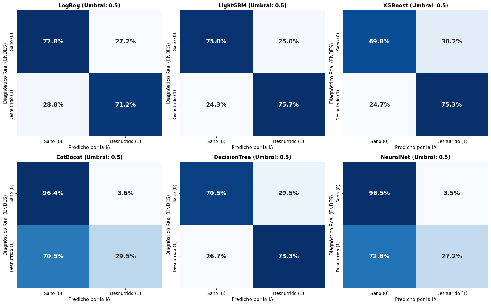
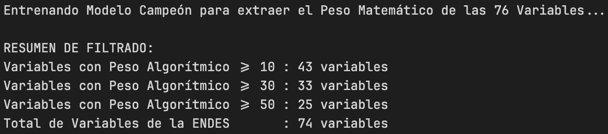
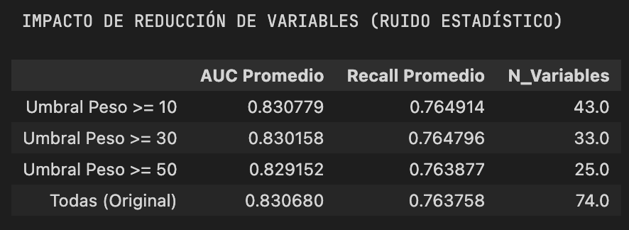

# FASE 4: MODELADO

---

### Diapositiva 4.1: Estrategia de Validación Científica

**Contenido Visual:**

**¿Por qué no un split aleatorio clásico (70/30)?**

| Problema                                                     | Consecuencia si se ignora                                     |
| ------------------------------------------------------------ | ------------------------------------------------------------- |
| Target Drift: prevalencia bajó de ~30% (2007) a ~11% (2024) | El modelo aprende un riesgo base que no existe en el presente |
| Desbalance de clases: 16% positivos / 84% negativos          | El Accuracy miente — predecir siempre "sano" da 84%          |
| ENDES es muestra compleja con pesos muestrales (`HV005`)   | Las métricas sin ponderar sobrerepresentan zonas urbanas     |

**Estrategia adoptada: Validación Cruzada Estratificada 5-Fold con pesos ENDES**

```python
StratifiedKFold(n_splits=5, shuffle=True, random_state=42)
# → Cada fold mantiene la proporción de clases (16%/84%)
# → Métricas ponderadas por HV005 / 1,000,000 en validación
# → 6 modelos evaluados | 74 variables de entrada | 285,284 niños
```

| Parámetro               | Valor                                               |
| ------------------------ | --------------------------------------------------- |
| Folds                    | 5                                                   |
| Estratificación         | Por clase (16% positivos asegurado por fold)        |
| Ponderación             | `HV005 / 1,000,000` — factor de expansión ENDES |
| Umbral de clasificación | 0.5 (fijo)                                          |
| Métrica primaria        | AUC-ROC                                             |
| Métrica de política    | Recall (Sensibilidad) ≥ 80%                        |

**Guion del Expositor:**

> "Antes de mostrar los resultados, hay que entender por qué la estrategia de validación importa tanto como el algoritmo. Si hacemos un split aleatorio del 70-30, el problema del Target Drift contamina todo: los datos de 2007 con 30% de prevalencia se mezclan con los de 2024 con 11%, y el modelo aprende una distribución que ya no existe. El desbalance de clases implica que predecir siempre 'sano' da un Accuracy del 84% — esa es la razón por la que el Accuracy está completamente prohibido como métrica en este proyecto. Y la ENDES no es una muestra aleatoria simple — es una muestra compleja con pesos de expansión. Si no aplicamos el factor HV005 al evaluar, estamos sobrerepresentando zonas urbanas donde los recursos son más accesibles. La solución fue Validación Cruzada Estratificada de 5 Folds: cada fold tiene exactamente la misma proporción de clases, y las métricas se calculan ponderadas por el factor de expansión del INEI."

---

### Diapositiva 4.2: Benchmarking de 6 Modelos

**Contenido Visual:**

**Resultados promedio 5-Fold CV (ponderado por HV005):**

| Pos | Modelo             | AUC Promedio     | Recall Promedio  | Precision Promedio | F1-Score | Tiempo/fold |
| --- | ------------------ | ---------------- | ---------------- | ------------------ | -------- | ----------- |
| 1   | **LightGBM** | **0.8307** | **76.38%** | 36.90%             | 0.4976   | 3.7 s       |
| 2   | CatBoost           | 0.8302           | 29.99%           | **60.99%**   | 0.4021   | 88.2 s      |
| 3   | NeuralNet          | 0.8219           | 25.12%           | 61.16%             | 0.3554   | 115.8 s     |
| 4   | XGBoost            | 0.7937           | 75.73%           | 32.75%             | 0.4573   | 5.4 s       |
| 5   | LogReg             | 0.7924           | 71.67%           | 33.97%             | 0.4609   | 1.2 s       |
| 6   | DecisionTree       | 0.7817           | 71.76%           | 32.90%             | 0.4509   | 4.3 s       |

**La paradoja CatBoost / NeuralNet:**

> AUC ≈ LightGBM, pero Recall < 30% — detectan menos de 1 de cada 3 niños desnutridos.
> El umbral 0.5 combinado con su función de pérdida los hace conservadores: prefieren no etiquetar.
> En triaje de política pública, ese comportamiento es inaceptable.

> `[INSERTAR: notebooks/03_modeling/03_model_benchmarking_extended.ipynb` — Celda 6: curvas ROC "Curvas ROC - Batalla de Modelos Unificada". 6 curvas superpuestas, LightGBM en línea gruesa (linewidth=3). Eje X: Tasa de Falsos Positivos. Eje Y: Sensibilidad. AUC exacto de cada modelo en la leyenda. Diagonal negra punteada = clasificador aleatorio.]`
> 

> `[INSERTAR: notebooks/03_modeling/03_model_benchmarking_extended.ipynb` — Celda 7: curvas Precision-Recall "Curvas Precision-Recall - Batalla de Modelos Unificada". 6 curvas superpuestas. Eje X: Recall. Eje Y: Precisión. PR-AUC de cada modelo en leyenda. Evidencia visual del colapso de LightGBM en precisión a alto Recall.]`
> 

> `[INSERTAR: notebooks/03_modeling/03_model_benchmarking_extended.ipynb` — Celda 8: grilla 2×3 de matrices de confusión normalizadas (umbral 0.5, pesos HV005). Filas: "Sano (0)" / "Desnutrido (1)" real. Columnas: predicho. Muestra visualmente que CatBoost y NeuralNet clasifican >70% de desnutridos como sanos.]`
> 

**Guion del Expositor:**

> "Los 6 modelos se entrenaron bajo las mismas condiciones: mismos folds, mismos pesos, misma semilla. El resultado tiene una enseñanza crítica que no está en los libros de texto. CatBoost tiene un AUC de 0.8302 — prácticamente igual que LightGBM. Pero su Recall es del 30%. Eso significa que de cada 10 niños desnutridos, CatBoost deja 7 sin detectar. La Red Neuronal tiene la misma patología: AUC alto, Recall del 25%. ¿Por qué? Porque el AUC mide la capacidad discriminativa del modelo a lo largo de todos los umbrales posibles — es una métrica del modelo puro. Pero lo que importa en producción es qué pasa al umbral de 0.5: CatBoost y NeuralNet son conservadores, necesitan estar muy seguros para etiquetar a un niño como desnutrido. En triaje de política pública ese conservadurismo es un error de diseño. LightGBM logra el AUC más alto y simultáneamente el Recall más alto — ese doble liderazgo es la razón matemática para elegirlo como campeón."

---

### Diapositiva 4.3: El Campeón — LightGBM con Top 43 Variables

**Contenido Visual:**

**Selección de variables por umbral de importancia algorítmica:**

Se entrenó LightGBM sobre las 74 variables para extraer importancias nativas (`feature_importances_`). Solo se conservaron las variables con peso algorítmico ≥ 10.

> `[INSERTAR: notebooks/03_modeling/03_model_benchmarking_extended.ipynb` — Celda 10: print de terminal "RESUMEN DE FILTRADO". Muestra las 3 líneas: "Variables con Peso Algorítmico >= 10: 43 variables / >= 30: 33 variables / >= 50: 25 variables / Total ENDES: 74 variables". Captura como bloque de texto.]`
> 

| Escenario                        | AUC (5-Fold CV)    | Recall           | Variables    |
| -------------------------------- | ------------------ | ---------------- | ------------ |
| **Umbral ≥ 10 (elegido)** | **0.830779** | **76.49%** | **43** |
| Umbral ≥ 30                     | 0.830158           | 76.48%           | 33           |
| Umbral ≥ 50                     | 0.829152           | 76.39%           | 25           |
| Todas las variables              | 0.830680           | 76.38%           | 74           |

> `[INSERTAR: notebooks/03_modeling/03_model_benchmarking_extended.ipynb` — Celda 12: tabla pandas de los 4 escenarios. Columnas: Escenario, AUC Promedio, Recall Promedio, N_Variables. Muestra que Umbral >= 10 (43 vars) tiene el AUC y Recall más altos — incluso superiores al modelo con todas las 74 variables.]`

> El modelo con **43 variables** supera marginalmente al modelo con las **74 originales** en ambas métricas.
> Las 31 variables eliminadas eran ruido — su presencia no sumaba y sí agregaba varianza.

**Métricas del modelo en producción:**

| Métrica                   | Valor                       |
| -------------------------- | --------------------------- |
| AUC-ROC                    | **0.8308**            |
| Recall (Sensibilidad)      | **76.49%**            |
| Precision                  | 37.05%                      |
| F1-Score                   | 0.4976                      |
| Umbral de producción      | 0.5 (hardcoded)             |
| Variables en producción   | 43                          |
| Registros de entrenamiento | 285,284 niños (2007–2024) |

**Guion del Expositor:**

> "El paso final del modelado fue verificar si todas las 74 variables eran necesarias. Entrenamos LightGBM sobre el dataset completo, extrajimos las importancias algorítmicas nativas y definimos tres umbrales de corte: 10, 30 y 50. El resultado es contraintuitivo pero bien documentado en la literatura: el modelo con 43 variables tiene un AUC de 0.830779 y un Recall del 76.49%, mientras que el modelo con las 74 variables originales tiene 0.830680 y 76.38%. Las 31 variables eliminadas no eran predictores — eran ruido que aumentaba la varianza del modelo. 43 es el número óptimo. El modelo final se entrena con esas 43 variables sobre el 100% de los datos y se exporta a producción. Una nota técnica importante: el umbral de clasificación está fijado en 0.5. El objetivo de política es alcanzar un Recall del 80%, lo que requeriría bajar ese umbral. Ese es el margen de mejora inmediata disponible sin reentrenar el modelo."
