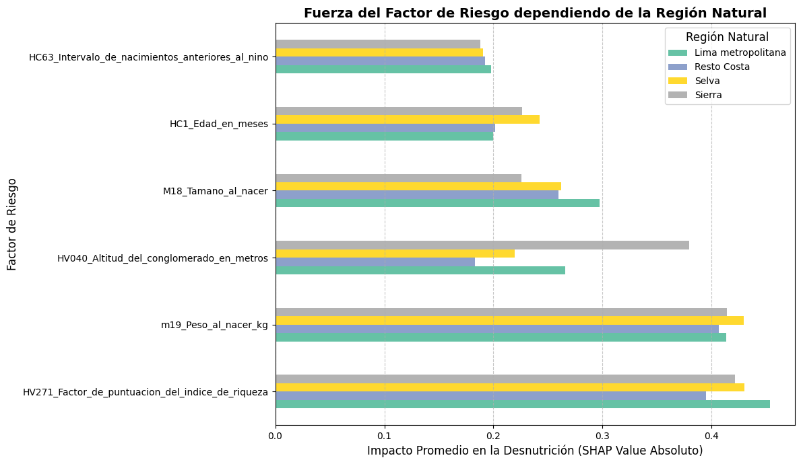
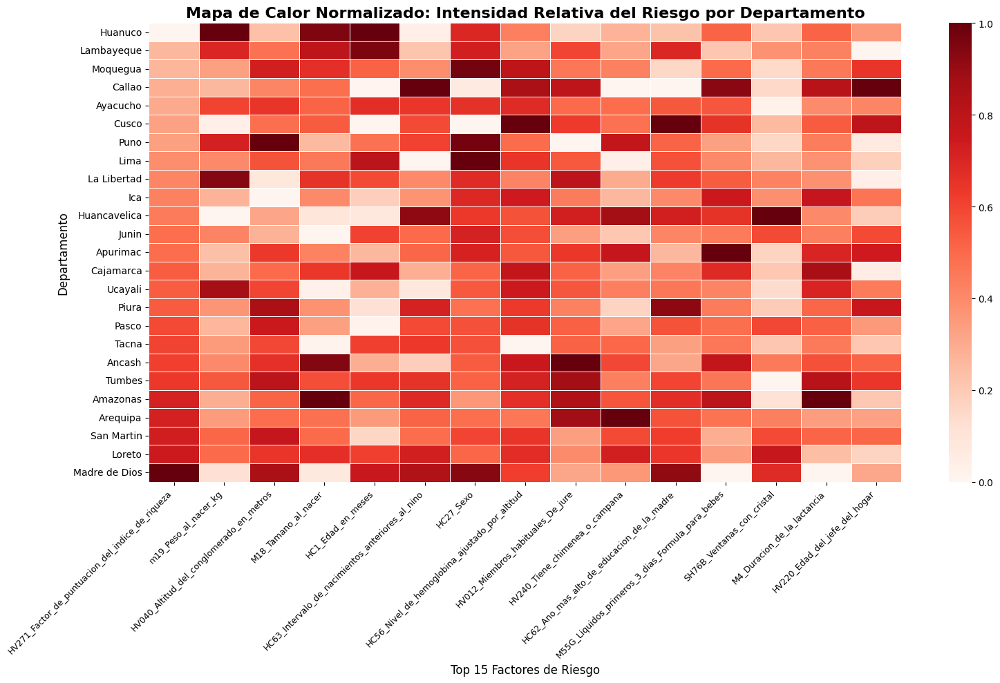

# FASE 5: EXPLICABILIDAD

---

### Diapositiva 5.1: El ADN Global de la Desnutrición — SHAP Summary Plot

**Contenido Visual:**

**¿Qué es un valor SHAP?**

Para cada predicción, SHAP calcula cuánto empujó cada variable hacia "desnutrido" o hacia "sano" — variable por variable, niño por niño.

> Calculado con `shap.TreeExplainer` sobre una muestra estratificada de **10,000 niños** del dataset completo.

**Top 15 variables por importancia SHAP global:**

| Pos | Variable  | Descripción                                  |
| --- | --------- | --------------------------------------------- |
| 1   | `HV271` | Índice de riqueza del hogar (score continuo) |
| 2   | `m19`   | Peso al nacer (kg)                            |
| 3   | `HV040` | Altitud del conglomerado (metros)             |
| 4   | `HC1`   | Edad del niño en meses                       |
| 5   | `HC56`  | Hemoglobina ajustada por altitud (INEI)       |
| 6   | `HC63`  | Intervalo desde nacimiento anterior           |
| 7   | `M4`    | Duración total de la lactancia               |
| 8   | `HV220` | Edad del jefe del hogar                       |
| 9   | `M46`   | Días de suplemento de hierro en gestación   |
| 10  | `M18`   | Tamaño al nacer (percepción materna)        |
| 11  | `m34`   | Horas hasta inicio de la lactancia            |
| 12  | `M14`   | Número de visitas prenatales                 |
| 13  | `HC62`  | Años de educación de la madre               |
| 14  | `HC27`  | Sexo del niño                                |
| 15  | `HV012` | Miembros habituales del hogar                 |

> `[INSERTAR: notebooks/03_modeling/03_model_explainability.ipynb` — Celda 5: SHAP Summary Plot (beeswarm). Eje Y: Top 15 variables ordenadas de mayor a menor importancia global. Eje X: SHAP value (derecha = mayor riesgo de desnutrición). Color rojo = valor alto de la variable, azul = valor bajo. Muestra la distribución de impacto de cada variable sobre los 10,000 niños de la muestra.]`

**Guion del Expositor:**

> "Hasta aquí sabemos que el modelo funciona. Pero en política pública no basta con que funcione — necesitamos saber por qué. Los valores SHAP nos dan esa respuesta, variable por variable, niño por niño. El gráfico que ven es el 'ADN de la desnutrición': las 15 variables más influyentes ordenadas de arriba hacia abajo. El índice de riqueza del hogar es el factor dominante — un punto bajo en este índice empuja fuertemente hacia la predicción de desnutrición. El segundo lugar es el peso al nacer: un bebé que nació con bajo peso ya parte con una desventaja biológica que el modelo detecta con claridad. El tercer lugar es la altitud — y aquí viene un hallazgo geográfico que vamos a ver en detalle en la siguiente diapositiva. La edad en meses en el puesto 4 captura la ventana crítica de los primeros 1000 días que describimos en el análisis exploratorio. Y el suplemento de hierro durante la gestación, en el puesto 9, confirma que las intervenciones prenatales tienen peso predictivo real sobre el resultado nutricional del niño."

---

### Diapositiva 5.2: Cómo Muta el Riesgo por Territorio

**Contenido Visual:**

**El riesgo no es uniforme — cambia según la región:**

> `[INSERTAR: notebooks/03_modeling/03_model_explainability.ipynb` — Celda 6: gráfico de barras horizontales agrupadas "Fuerza del Factor de Riesgo dependiendo de la Región Natural". Eje X: Impacto Promedio (SHAP absoluto). Eje Y: Top 6 variables globales. Una barra por región: Costa / Sierra / Selva. Colormap Set2. Muestra visualmente que la altitud casi no aparece en Costa, pero es el factor dominante en Sierra.]`
> 

**Ejemplo concreto:**

| Variable                | Costa            | Sierra                    | Selva                     |
| ----------------------- | ---------------- | ------------------------- | ------------------------- |
| Índice de riqueza      | Alto impacto     | Alto impacto              | Alto impacto              |
| Altitud (`HV040`)     | Impacto mínimo  | **Impacto máximo** | Impacto bajo              |
| Hemoglobina (`HC56`)  | Impacto bajo     | **Impacto elevado** | Impacto bajo              |
| Peso al nacer (`m19`) | Impacto moderado | Impacto moderado          | **Impacto elevado** |

**Intensidad relativa de riesgo por departamento (Top 15 variables):**

> `[INSERTAR: notebooks/03_modeling/03_model_explainability.ipynb` — Celda 7: heatmap seaborn "Mapa de Calor Normalizado: Intensidad Relativa del Riesgo por Departamento". Eje X: Top 15 variables (rotadas 45°). Eje Y: 25 departamentos ordenados por el factor más importante. Colormap Reds. Escala 0–1 normalizada por columna (1 = departamento más afectado por ese factor). Sin anotaciones numéricas.]`
> 

**Guion del Expositor:**

> "El hallazgo más importante de la explicabilidad regional es que la desnutrición en el Perú no tiene una causa única — tiene causas distintas según el territorio. En la Costa, el determinante es casi exclusivamente socioeconómico: el índice de riqueza lo explica casi todo. En la Sierra, la altitud entra como factor de riesgo adicional: a 4,000 metros la hemoglobina se comporta distinto, el desarrollo físico es más lento, y el modelo lo detecta con claridad. En la Selva, el factor diferencial es el peso al nacer — probablemente relacionado con la menor cobertura prenatal y el acceso más limitado a establecimientos de salud. El heatmap por departamento hace esto concreto a nivel político: Huancavelica y Apurímac tienen el rojo más intenso en altitud y hemoglobina. Lima y Callao tienen el rojo en riqueza pero verde en altitud. Cajamarca tiene una firma mixta. Este mapa es directamente accionable: un responsable regional en Puno va a intervenir de forma distinta a uno en Loreto, y el modelo le dice exactamente por qué."
