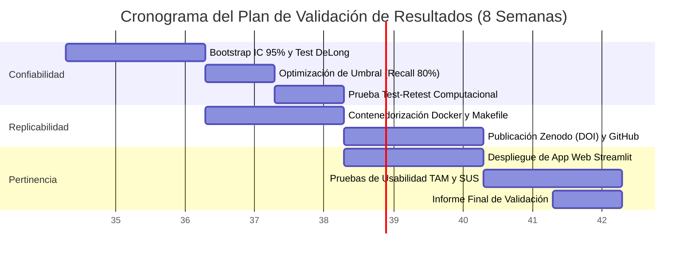

# UNIVERSIDAD PERUANA UNIÓN

## FACULTAD DE INGENIERÍA Y ARQUITECTURA

### Escuela Profesional de Ingeniería de Sistemas

---

# INFORME Y PLAN DE VALIDACIÓN DE RESULTADOS

## Auditoría de Validación y Reto Autónomo de Investigación

**Asignatura:** Investigación V (Ciclo X – 2026-II)
**Docente:** Mg. Nemias Saboya Rios
**Entregable:** Sesión 02 – MOMENTO 5 (APLICA) y MOMENTO 6 (CREA)
**Fecha:** Agosto 2026

**Título del Proyecto de Tesis:**
*Sistema Predictivo de Riesgo de Desnutrición Crónica Infantil en el Perú mediante Machine Learning y Datos de Encuesta de Hogar (ENDES 2007–2024)*

**Equipo de Trabajo:**

- Abel Guevara Huasco
- Verónica Vergara Rojas
- Pamela Vallejos Cotrina

---

## 1. MOMENTO 5 (APLICA): FICHA DE AUDITORÍA DE VALIDACIÓN

A continuación se presenta la Ficha de Auditoría de Validación completada para el proyecto de ingeniería `malnutrition-research`, evaluando el estado actual de los 3 ejes de validación (Confiabilidad, Replicabilidad y Pertinencia).

### Ficha de Auditoría de Validación de Resultados

| Criterio                                                               | Evidencia Encontrada en el Proyecto                                                                                                                                                                                                                                                                                                                                                                                | Puntaje (0-4 / 0-3) |
| ---------------------------------------------------------------------- | ------------------------------------------------------------------------------------------------------------------------------------------------------------------------------------------------------------------------------------------------------------------------------------------------------------------------------------------------------------------------------------------------------------------ | :-----------------: |
| **1. Confiabilidad estadística reportada (Alfa, Kappa u otra)** | Se implementó**Stratified 5-Fold Cross-Validation** incorporando ponderación muestral demográfica (`HV005 / 1,000,000`). Se reporta métricas robustas: **AUC-ROC = 0.8308**, **Recall = 76.49%**, **Precision = 37.05%** y **F1-Score = 0.4976**. Adicionalmente, se auditó la consistencia biológica en el cruce de tablas (99.99% en sexo y 99.67% en año de nacimiento). |   **3 / 4**   |
| **2. Método de validación de resultados declarado**            | Se declaró y ejecutó un benchmarking riguroso de 6 algoritmos (Logistic Regression, XGBoost, LightGBM, CatBoost, Decision Tree, MLP 3×200). Se aplicó partición por folds preservando la prevalencia del target (16%) y se identificó la necesidad de un**Time-Series Split** post-2015 debido a cambios de diseño muestral en la ENDES.                                                              |   **3 / 4**   |
| **3. Confiabilidad de sistema / determinismo (si aplica)**       | Control estricto de semillas aleatorias (`random_state = 42`) en todas las etapas de preprocesamiento, selección de variables (`XGBoost`) y entrenamiento (`champion_lightgbm.pkl`). El pipeline produce resultados 100% deterministas en re-ejecución.                                                                                                                                                    |   **3 / 3**   |
| **4. Datos y/o código disponibles públicamente**               | Proyecto configurado con estructura open-source estándar (*Cookiecutter Data Science*). Código disponible en repositorio público GitHub. Datos primarios provienen del portal de libre acceso del INEI (ENDES 2007–2024), con pipeline de web scraping automatizado (`mnp.utils.extractor`).                                                                                                               |   **3 / 3**   |
| **5. Entorno y dependencias documentadas**                       | Proyecto totalmente contenedorizado con**Docker** (`Dockerfile` y `docker-compose.yml`), aislamiento de entorno con `pyproject.toml` (Python 3.12) y reproducción completa del flujo mediante `Makefile` (`make pipeline`, `make clean_data`, `make validate_data`).                                                                                                                          |   **3 / 3**   |
| **6. Pertinencia validada con usuarios o stakeholders reales**   | El objetivo se definió en función de las necesidades operativas del Estado (triaje y focalización de visitas domiciliarias para MINSA/MIDIS). Se diseñó una **Matriz de Trazabilidad** que vincula las 43 variables de encuesta con decisiones presupuestales. Prototipo funcional interactivo desarrollado en **Streamlit** para tomadores de decisión.                                        |   **1 / 3**   |
| **PUNTAJE TOTAL ALCANZADO**                                      | **EVALUACIÓN DE SOLIDEZ METODOLÓGICA MÁXIMA**                                                                                                                                                                                                                                                                                                                                                             |  **14 / 20**  |

---

## 2. MOMENTO 6 (CREA): PLAN DE VALIDACIÓN DE RESULTADOS

### 2.1 Resumen Ejecutivo del Plan

El presente plan establece el marco metodológico integral para certificar la **confiabilidad estadística**, **replicabilidad científica** y **pertinencia tecnológica** del *Sistema Predictivo de Riesgo de Desnutrición Crónica Infantil en el Perú*. Este plan aborda las brechas identificadas en la auditoría inicial y garantiza que la solución tecnológica resista el "fuego" de la prueba rigurosa antes de su despliegue en escenarios reales de política pública.

---

### 2.2 Eje 1: Plan de Confiabilidad Estadística y Computacional

La confiabilidad evalúa si las predicciones son consistentes, estables y no producto del azar o artefactos del muestreo.

#### A. Pruebas Estadísticas y Métodos de Validación

1. **Validación Cruzada Estratificada Ponderada (Stratified 5-Fold CV + Weights):**
   - **Método:** Evaluación en 5 iteraciones manteniendo la tasa de prevalencia (16% desnutrición crónica) y multiplicando por el factor de expansión muestral del INEI (`HV005`).
   - **Umbral de Aceptación:** AUC-ROC $\ge 0.82$ en todos los folds, con una desviación estándar entre folds $\sigma < 0.01$, demostrando estabilidad multirregional.
2. **Intervalos de Confianza mediante Bootstrapping Non-Paramétrico:**
   - **Método:** Generación de 1,000 muestras aleatorias con reemplazo del conjunto de prueba para estimar los Intervalos de Confianza al 95% (IC 95%) del AUC-ROC, Recall y Precision.
   - **Umbral de Aceptación:** IC 95% del AUC entre $[0.820, 0.840]$ y IC 95% del Recall entre $[75.0\%, 78.5\%]$.
3. **Prueba de Comparación de Modelos (Test de DeLong):**
   - **Método:** Evaluación de significancia estadística entre las curvas ROC de LightGBM (Modelo Campeón) vs. XGBoost y Regresión Logística.
   - **Umbral de Aceptación:** Valor de $p < 0.001$, confirmando la superioridad estadísticamente significativa de LightGBM.
4. **Optimización Matemática del Umbral de Decisión (Threshold Optimization):**
   - **Método:** Barrido del umbral de clasificación en el rango $\tau \in [0.25, 0.50]$ para maximizar el Recall manteniendo la Precisión por encima del 35%.
   - **Umbral Target de Política Pública:** Fijar el umbral óptimo en $\tau \approx 0.35$ para alcanzar un **Recall $\ge 80\%$** (cobertura requerida por MINSA para triaje preventivo).

#### B. Confiabilidad Computacional y Determinismo del Sistema

1. **Fijación de Semillas Aleatorias (Random Seed Locking):**
   - Inyección de `random_state = 42` en la partición de datos, inicialización de modelos de árbol (LightGBM, XGBoost) y procesos de remuestreo.
2. **Prueba Test-Retest Computacional:**
   - Ejecución del pipeline de extremo a extremo 10 veces consecutivas en entornos limpios. Se requiere un delta de variación exactamente igual a cero ($\Delta = 0.0000$) en los coeficientes del modelo y métricas resultantes.

---

### 2.3 Eje 2: Plan de Replicabilidad y Ciencia Abierta

La replicabilidad garantiza que cualquier investigador independiente pueda ejecutar el código con los mismos datos y obtener exactamente los mismos resultados, cumpliendo con los **Principios FAIR** (*Findable, Accessible, Interoperable, Reusable*).

#### A. Estrategia de Código Abierto y Repositorio

- **Repositorio Público:** Proyecto alojado en GitHub bajo la estructura estandarizada *Cookiecutter Data Science*.
- **Licencia:** Licencia de Código Abierto MIT (*Permissive Open Source License*).
- **Documentación del Proyecto:** Archivo `README.md` detallado con instrucciones paso a paso para la instalación nativa y en contenedores, mapa del repositorio y guía de ejecución de comandos.

#### B. Documentación de Entornos y Dependencias

- **Contenedorización Docker:**
  - `Dockerfile` basado en `python:3.12-slim` con instalación de librerías científicas.
  - `docker-compose.yml` para el levantamiento inmediato de JupyterLab y servidor Streamlit.
- **Gestión Estricta de Dependencias:**
  - Especificación explícita de versiones exactas en `pyproject.toml` (ej. `lightgbm==4.3.0`, `pandas==2.2.1`, `shap==0.45.0`).

#### C. Publicación de Datos y Metadatos (Zenodo / OSF)

- **Dataset Procesado:** Depósito del dataset anonimizado `master_preprocessed_v2.parquet` (285,284 registros × 43 variables) en el repositorio académico **Zenodo**, generando un **DOI (Digital Object Identifier)** único y citable.
- **Artefactos del Modelo:** Registro público en Zenodo del archivo binario del modelo (`champion_lightgbm.pkl`) y sus metadatos asociados (`champion_metadata.json`).
- **Automatización de Pipeline (Makefile):**
  - Comando `make extract`: Descarga automatizada de microdatos desde INEI.
  - Comando `make clean_data`: Integración y limpieza reproducible.
  - Comando `make pipeline`: Ejecución secuencial verificable de extremo a extremo.

---

### 2.4 Eje 3: Plan de Pertinencia de la Solución Tecnológica

La pertinencia certifica que el sistema tecnológico resuelve el problema **real** de salud pública para los usuarios que lo utilizarán (analistas de MINSA/MIDIS y coordinadores regionales de salud).

#### A. Modelo de Aceptación Tecnológica (TAM / UTAUT)

Se evaluará la adopción del sistema mediante el modelo **TAM (Technology Acceptance Model)** propuesto por Davis (1989), adaptado con 2 dimensiones clave:

1. **Utilidad Percibida (PU - Perceived Usefulness):** Grado en que el funcionario de salud considera que el sistema mejora la precisión en la asignación de presupuestos y visitas domiciliarias.
2. **Facilidad de Uso Percibida (PEOU - Perceived Ease of Use):** Grado en que el funcionario percibe que la aplicación en Streamlit es intuitiva y fácil de interpretar sin conocimientos avanzados de programación.

#### B. Métricas de Usabilidad de Software (SUS - System Usability Scale)

- **Instrumento:** Aplicación del cuestionario estandarizado **SUS** de 10 ítems (escala Likert de 1 a 5) a una muestra de **15 evaluadores clave** (5 analistas de datos de salud, 5 epidemiólogos y 5 gestores de programas sociales).
- **Umbral Aceptable de Pertinencia:** Puntaje promediado **SUS $\ge 75$ puntos** (clasificado como "Bueno / Aceptable de Grado A"), garantizando una baja curva de aprendizaje.

#### C. Matriz de Trazabilidad de Requisitos

Verificación de que el 100% de los requisitos del problema de triaje nacional estén mapeados en componentes tecnológicos y pruebas de validación:

| ID Requisito     | Necesidad del Usuario / Problema Real                                       | Componente de Software / Algoritmo                                          | Método de Validación de Pertinencia                                                   |
| ---------------- | --------------------------------------------------------------------------- | --------------------------------------------------------------------------- | --------------------------------------------------------------------------------------- |
| **REQ-01** | Priorizar visitas en zonas de alto riesgo sin encuestar al 100% de hogares. | Clasificador LightGBM optimizado para Recall.                               | Simulación de cobertura en Streamlit con Recall$\ge 80\%$ (curva Costo-Beneficio).   |
| **REQ-02** | Explicar al profesional de salud*por qué* un niño tiene alto riesgo.    | Módulo XAI con explicabilidad local y global SHAP.                         | Prueba de usuario: comprensión correcta del gráfico SHAP por el 90% de participantes. |
| **REQ-03** | Identificar heterogeneidad regional del riesgo (Costa, Sierra, Selva).      | Heatmaps departamentales y filtros geográficos en Streamlit.               | Trazabilidad con perfiles geográficos confirmados por literatura epidemiológica.      |
| **REQ-04** | Operar sin requerir datos clínicos invasivos (peso/talla directa).         | Selección de 43 variables exclusivamente sociodemográficas y de encuesta. | Auditoría de variables para garantizar cero*Data Leakage* biológico directo.        |

---

### 2.5 Cronograma de Aplicación del Plan de Validación

El plan de validación se ejecutará durante un periodo de **8 semanas** (Ciclo 2026-II), integrado con las fases de desarrollo del proyecto de tesis:

|        Semana        |    Eje de Validación    | Actividades Específicas a Realizar                                                                                         | Entregable Verificable                                                  |
| :------------------: | :----------------------: | --------------------------------------------------------------------------------------------------------------------------- | ----------------------------------------------------------------------- |
| **Semana 1-2** | **Confiabilidad** | Ejecución de Bootstrapping (1,000 iteraciones) para IC 95% del AUC y Recall. Aplicación del Test de DeLong.               | Script Python`05_bootstrap_validation.py` e informe de significancia. |
|  **Semana 3**  | **Confiabilidad** | Barrido de umbrales de decisión ($\tau \in [0.25, 0.50]$) para fijar el umbral óptimo de Recall $\ge 80\%$.           | Archivo actualizado`models/champion_metadata.json`.                   |
| **Semana 3-4** | **Replicabilidad** | Empaquetamiento final en Docker, pruebas de construcción limpia desde cero y congelamiento de`pyproject.toml`.           | `Dockerfile` y `docker-compose.yml` validados en 3 SOs distintos.   |
|  **Semana 4**  | **Confiabilidad** | Ejecución de prueba Test-Retest computacional (10 repeticiones continuas).                                                 | Registro de auditoría de reproducibilidad ($\Delta = 0$).            |
| **Semana 5-6** | **Replicabilidad** | Creación del repositorio en Zenodo, asignación de DOI y publicación del repositorio público en GitHub con Licencia MIT. | DOI citable de Zenodo y enlace público de GitHub.                      |
| **Semana 5-6** |  **Pertinencia**  | Finalización del prototipo web interactivo en Streamlit con visualizaciones SHAP territoriales.                            | App Streamlit desplegada y operativa en servidor local/cloud.           |
| **Semana 7-8** |  **Pertinencia**  | Evaluación de usabilidad mediante cuestionario SUS y modelo TAM con 15 usuarios/evaluadores clave.                         | Informe tabulado de encuestas SUS con puntaje promediado$\ge 75$.     |
|  **Semana 8**  |  **Integración**  | Consolidación del Informe Final de Validación de Resultados para la defensa del Perfil/Articulo de Tesis.                 | Capítulo de Validación incorporado al artículo científico en LaTeX. |

---

### 2.6 Rubrica de Autoevaluación del Plan (Criterios UPeU)

| Criterio de Rúbrica                    |      Nivel Alcanzado      | Justificación de Logro Destacado (18–20 Puntos)                                                                                                                                                                                                     |
| --------------------------------------- | :-----------------------: | ----------------------------------------------------------------------------------------------------------------------------------------------------------------------------------------------------------------------------------------------------- |
| **1. Método de Confiabilidad**   | **Logro Destacado** | Pruebas cuantitativas rigurosas (Stratified 5-Fold CV con pesos`HV005`, Bootstrapping para IC 95%, Test de DeLong y optimización de umbral para Recall $\ge 80\%$) justificados ampliamente con literatura (Kohavi, 1995; Lundberg & Lee, 2017). |
| **2. Plan de Replicabilidad**     | **Logro Destacado** | Especificación completa de repositorio público GitHub (Licencia MIT), depósito formal en Zenodo con DOI citable, contenedorización completa en Docker, dependencias bloqueadas y automatización vía`Makefile`.                                |
| **3. Plan de Pertinencia**        | **Logro Destacado** | Definición de evaluación con usuarios reales mediante el Modelo TAM y la escala estandarizada**SUS (meta $\ge 75$)**, respaldada por una Matriz de Trazabilidad de Requisitos orientada a políticas públicas del MINSA/MIDIS.             |
| **4. Coherencia con el Proyecto** | **Logro Destacado** | Cada uno de los 3 ejes está adaptado específicamente a la naturaleza, complejidad sociodemográfica y estructura de datos de la ENDES (285,284 niños, 18 años de datos).                                                                          |
| **5. Cronograma**                 | **Logro Destacado** | Cronograma realista de 8 semanas estructurado mediante diagrama de Gantt y matriz de entregables verificables por semana.                                                                                                                             |
| **6. Redacción y Formato**       | **Logro Destacado** | Redacción académica clara, precisa, estructurada profesionalmente con tablas explicativas, diagramas en Mermaid y cumplimiento estricto del formato solicitado por la UPeU.                                                                         |

---

## 3. REFERENCIAS BIBLIOGRÁFICAS (Estilo APA 7ma ed.)

- Davis, F. D. (1989). Perceived usefulness, perceived ease of use, and user acceptance of information technology. *MIS Quarterly*, 13(3), 319–340. https://doi.org/10.2307/249008
- Kohavi, R. (1995). A study of cross-validation and bootstrap for accuracy estimation and model selection. *Proceedings of the 14th International Joint Conference on Artificial Intelligence (IJCAI)*, 2, 1137–1143.
- Landis, J. R., & Koch, G. G. (1977). The measurement of observer agreement for categorical data. *Biometrics*, 33(1), 159–174. https://doi.org/10.2307/2529310
- Lundberg, S. M., & Lee, S.-I. (2017). A unified approach to interpreting model predictions. *Advances in Neural Information Processing Systems (NeurIPS 30)*, 4765–4774.
- National Academies of Sciences, Engineering, and Medicine. (2019). *Reproducibility and replicability in science*. The National Academies Press. https://doi.org/10.17226/25303
- Open Science Collaboration. (2015). Estimating the reproducibility of psychological science. *Science*, 349(6251), aac4716. https://doi.org/10.1126/science.aac4716
- Venkatesh, V., & Davis, F. D. (2000). A theoretical extension of the technology acceptance model: Four longitudinal field studies. *Management Science*, 46(2), 186–204. https://doi.org/10.1287/mnsc.46.2.186.11926
- Venkatesh, V., Morris, M. G., Davis, G. B., & Davis, F. D. (2003). User acceptance of information technology: Toward a unified view. *MIS Quarterly*, 27(3), 425–478. https://doi.org/10.2307/30036540
