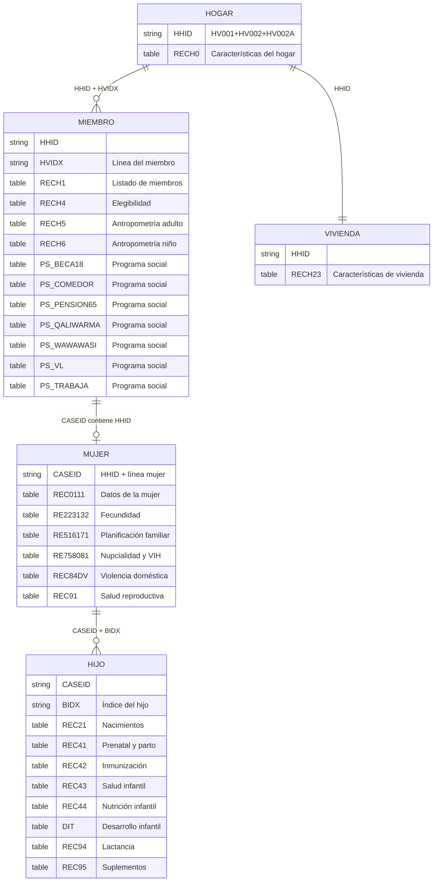
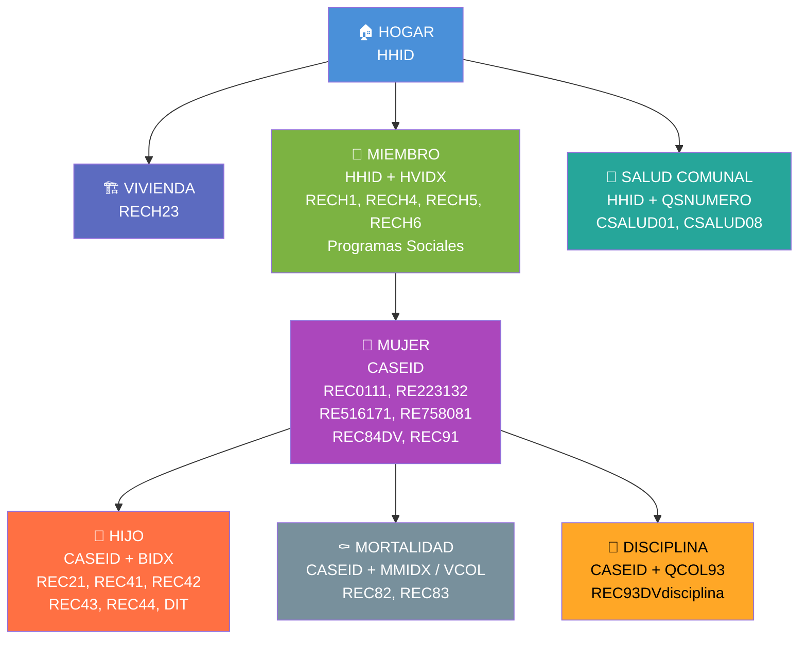

# Relaciones entre tablas ENDES 2024

## Jerarquía simplificada

## Cómo hacer JOINs

| Quiero cruzar... | JOIN por |
|---|---|
| Hogar ↔ Vivienda | `HHID` |
| Hogar ↔ Miembro | `HHID` (+ `HVIDX` para miembro específico) |
| Miembro ↔ Mujer | `HV001, HV002, HV002A` (componentes de HHID dentro de CASEID) |
| Mujer ↔ Hijo | `CASEID` (+ `BIDX` para hijo específico) |
| Hogar ↔ Salud comunal | `HHID` |
