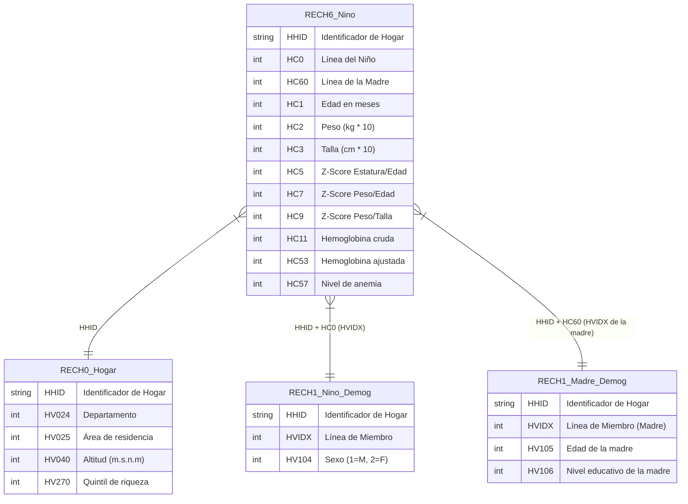

# Mapeo de Datos: Anemia y Antropometría Infantil (RECH6 + RECH1 + RECH0)

Este documento detalla la matriz de mapeo (*Source-to-Target Mapping*) para consolidar un dataset analítico enfocado en el análisis de **anemia, peso y talla infantil** de la ENDES.

Para realizar un análisis epidemiológico completo, los datos de antropometría del niño (`RECH6`) se deben cruzar con:
1. **Datos Demográficos del Niño (`RECH1`)**: Para obtener sexo y validaciones.
2. **Datos de la Madre (`RECH1` / `REC0111`)**: Usando la línea de la madre (`HC60`) para obtener su educación y edad.
3. **Características del Hogar (`RECH0`)**: Para obtener el departamento, altitud, área de residencia (urbano/rural) y quintil de riqueza.

---

## 📐 Diagrama de Relaciones y Joins

El cruce se realiza a nivel de Hogar (`HHID`) combinando las líneas del miembro (`HVIDX`) tanto del niño como de su respectiva madre:



---

## 📋 Matriz de Mapeo de Datos (Source-to-Target)

| DESTINO | | | | ORIGEN | | |
| :---: | :--- | :--- | :---: | :--- | :--- | :--- |
| **N°** | **Campo Destino** | **Descripción del Campo** | **Llave** | **Tabla Origen** | **Query / Spark SQL** | **Campo Origen / Lógica de Carga** |
| **1** | `id_hogar` | Identificador único del hogar | **PK, FK** | `RECH6` | `c.HHID` | `HHID` (Cadena de texto limpia) |
| **2** | `id_nino` | Línea o código secuencial del niño en el hogar | **PK** | `RECH6` | `c.HC0` | `HC0` (Entero) |
| **3** | `sexo_nino` | Sexo biológico del menor | - | `RECH1` (niño) | `n.HV104` | `HV104` (Mapeo: `1` ➔ "Masculino", `2` ➔ "Femenino") |
| **4** | `edad_meses` | Edad del niño medida en meses | - | `RECH6` | `c.HC1` | `HC1` (Entero) |
| **5** | `peso_kg` | Peso del menor en kilogramos | - | `RECH6` | `c.HC2 / 10.0` | `HC2` (Dividir entre 10 para obtener 1 decimal, ej. `145` ➔ `14.5`) |
| **6** | `talla_cm` | Talla/estatura del menor en centímetros | - | `RECH6` | `c.HC3 / 10.0` | `HC3` (Dividir entre 10 para obtener 1 decimal, ej. `928` ➔ `92.8`) |
| **7** | `zscore_talla_edad` | Desviación estándar de Talla para la Edad | - | `RECH6` | `c.HC5 / 100.0` | `HC5` (Dividir entre 100 para obtener Z-score con 2 decimales, ej. `-234` ➔ `-2.34`) |
| **8** | `zscore_peso_edad` | Desviación estándar de Peso para la Edad | - | `RECH6` | `c.HC7 / 100.0` | `HC7` (Dividir entre 100 para obtener Z-score con 2 decimales) |
| **9** | `zscore_peso_talla` | Desviación estándar de Peso para la Talla (Aguda) | - | `RECH6` | `c.HC9 / 100.0` | `HC9` (Dividir entre 100 para obtener Z-score con 2 decimales) |
| **10** | `hemoglobina_cruda` | Nivel de hemoglobina observado (sin ajustar) | - | `RECH6` | `c.HC11 / 10.0` | `HC11` (Dividir entre 10 para obtener g/dl con 1 decimal, ej. `112` ➔ `11.2`) |
| **11** | `hemoglobina_ajustada` | Nivel de hemoglobina corregido por la altitud | - | `RECH6` | `c.HC53 / 10.0` | `HC53` (Dividir entre 10 para obtener g/dl corregido por m.s.n.m.) |
| **12** | `nivel_anemia` | Clasificación epidemiológica de la anemia infantil | - | `RECH6` | `c.HC57` | `HC57` (Categorías SPSS decodificadas: Severa, Moderada, Leve, Sin Anemia) |
| **13** | `id_madre` | Línea de miembro correspondiente a la madre | **FK** | `RECH6` | `c.HC60` | `HC60` (Identifica el registro de la madre en `RECH1` o `REC0111`) |
| **14** | `edad_madre` | Edad actual de la madre en años | - | `RECH1` (madre) | `m.HV105` | `HV105` (Entero, obtenido cruzando `HC60` con la tabla de miembros) |
| **15** | `educacion_madre` | Grado de instrucción alcanzado por la madre | - | `RECH1` (madre) | `m.HV106` | `HV106` (Mapeo: Sin educación, Primaria, Secundaria, Superior) |
| **16** | `departamento` | Departamento geográfico del hogar | - | `RECH0` | `h.HV024` | `HV024` (Mapeo de etiquetas departamentales) |
| **17** | `area_residencia` | Entorno habitacional (Urbano o Rural) | - | `RECH0` | `h.HV025` | `HV025` (Mapeo: `1` ➔ "Urbano", `2` ➔ "Rural") |
| **18** | `altitud_metros` | Altitud del conglomerado (metros sobre el nivel del mar) | - | `RECH0` | `h.HV040` | `HV040` (Entero, clave para calcular el ajuste de hemoglobina) |
| **19** | `quintil_riqueza` | Nivel socioeconómico del hogar (1 al 5) | - | `RECH0` | `h.HV270` | `HV270` (Mapeo: Muy Pobre, Pobre, Medio, Rico, Muy Rico) |

---

## 🛠️ Implementación en PySpark

A continuación se muestra el código modular para construir este cruce analítico en nuestro entorno de Spark, garantizando la integridad de los joins y el correcto escalamiento/formateo de los campos continuos:

```python
from pyspark.sql import SparkSession
from pyspark.sql.functions import col, when, concat_ws

def build_child_anemia_dataset(spark: SparkSession, silver_dir: str, year: str) -> DataFrame:
    """
    Construye el dataset analítico unificado para el análisis de anemia infantil.
    Cruza RECH6 (Niño) + RECH1 (Demográficos Niño y Madre) + RECH0 (Hogar).
    """
    
    # 1. Cargar las tablas del año especificado desde la capa Silver (Parquet)
    rech6_df = spark.read.parquet(f"{silver_dir}/{year}/anthropometry_anemia/rech6.parquet")
    rech1_df = spark.read.parquet(f"{silver_dir}/{year}/household/rech1.parquet")
    rech0_df = spark.read.parquet(f"{silver_dir}/{year}/household/rech0.parquet")
    
    # 2. Selección de demográficos del niño (RECH1)
    nino_demog = rech1_df.select(
        col("HHID").alias("n_HHID"),
        col("HVIDX").alias("n_HVIDX"),
        col("HV104").alias("sexo_nino")
    )
    
    # 3. Selección de demográficos de la madre (RECH1)
    madre_demog = rech1_df.select(
        col("HHID").alias("m_HHID"),
        col("HVIDX").alias("m_HVIDX"),
        col("HV105").alias("edad_madre"),
        col("HV106").alias("educacion_madre")
    )
    
    # 4. Selección de características del hogar (RECH0)
    hogar_df = rech0_df.select(
        col("HHID").alias("h_HHID"),
        col("HV024").alias("departamento"),
        col("HV025").alias("area_residencia"),
        col("HV040").alias("altitud_metros"),
        col("HV270").alias("quintil_riqueza")
    )
    
    # 5. Realizar el Join estructurado
    # Cruce base: Niño Antropometría (RECH6) -> Niño Demográficos (RECH1)
    consolidated_df = rech6_df \
        .join(nino_demog, 
              (col("HHID") == col("n_HHID")) & (col("HC0") == col("n_HVIDX")), 
              "left") \
        .join(madre_demog, 
              (col("HHID") == col("m_HHID")) & (col("HC60") == col("m_HVIDX")), 
              "left") \
        .join(hogar_df, 
              col("HHID") == col("h_HHID"), 
              "left")
              
    # 6. Transformar y formatear los campos analíticos
    final_df = consolidated_df.select(
        # Llaves
        col("HHID").alias("id_hogar"),
        col("HC0").cast("int").alias("id_nino"),
        
        # Datos del Niño (Ajustar decimales de variables epidemiológicas)
        col("sexo_nino"),
        col("HC1").cast("int").alias("edad_meses"),
        (col("HC2").cast("double") / 10.0).alias("peso_kg"),
        (col("HC3").cast("double") / 10.0).alias("talla_cm"),
        (col("HC5").cast("double") / 100.0).alias("zscore_talla_edad"),
        (col("HC7").cast("double") / 100.0).alias("zscore_peso_edad"),
        (col("HC9").cast("double") / 100.0).alias("zscore_peso_talla"),
        (col("HC11").cast("double") / 10.0).alias("hemoglobina_cruda"),
        (col("HC53").cast("double") / 10.0).alias("hemoglobina_ajustada"),
        col("HC57").alias("nivel_anemia"),
        
        # Datos de la Madre
        col("HC60").cast("int").alias("id_madre"),
        col("edad_madre").cast("int"),
        col("educacion_madre"),
        
        # Datos del Hogar
        col("departamento"),
        col("area_residencia"),
        col("altitud_metros").cast("int"),
        col("quintil_riqueza")
    )
    
    return final_df
```
